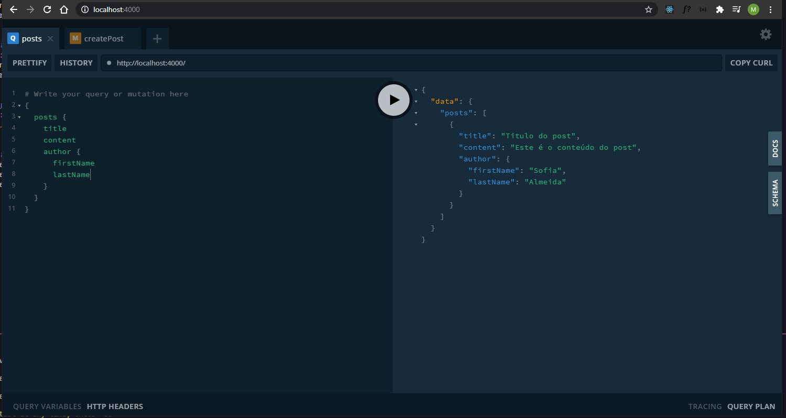

<h1 align="center">Api with GraphQL 🔥</h1>

### 💡 Users and Posts api to practice GraphQL concepts.
 

 

### Concepts learned in classes provided by Mateus Silva:

https://www.youtube.com/watch?v=7RoHxSGVAdU&list=PLPXWI3llyMiK9uw7tfljM2hnQl2qu6CeT